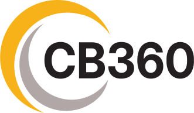

# CB360 e-commerce website

A brief description of what this project does and who it's for

## Documentation

[Documentation](https://linktodocumentation)

## Installation

System Requirements:

[Node.js 18.17](https://nodejs.org/) or later.

MacOS, Windows (including WSL), and Linux are supported.

### Automatic Installation

We recommend starting a new Next.js app using create-next-app, which sets up everything automatically for you. To create a project, run:

```bash
  npx create-next-app@latest

  npm run dev
```

## 🔗 Links

[](https://katherineoelsner.com/)
[](https://www.linkedin.com/)
[](https://twitter.com/)
